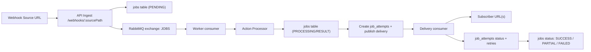

# Webhook Pipeline Service

Build a simplified Zapier-style service that ingests webhooks, processes them asynchronously, and delivers results to subscribers.

## Table of Contents
- [Overview](#overview)
- [Quick Start](#quick-start)
- [Architecture](#architecture)
- [Processing Actions](#processing-actions)
- [Database Schema](#database-schema)
- [API Overview](#api-overview)
- [CI/CD](#cicd)
- [Design Decisions](#design-decisions)

## Overview
This service lets users create **pipelines** that connect:
1. A **source** webhook URL
2. A **processing action**
3. One or more **subscriber** destination URLs

Incoming webhooks are queued and processed by a background worker. Results are then delivered to each subscriber with retry logic.

## Quick Start
Prerequisites:
- Docker + Docker Compose

Run everything with Docker:
```bash
docker compose up --build
```

Services started:
- API: `http://localhost:3000`
- Worker health: `http://localhost:8080`
- RabbitMQ Management UI: [RabbitMQ Management](http://localhost:15672) (user/pass: `guest/guest`)
- Postgres: `localhost:5433`

Environment variables are loaded from `.env` in the project root. The `docker-compose.yml` file also provides defaults for local development.

## Architecture
High-level flow:


Code layout:
- `src/presentation`: HTTP routes, controllers, middleware
- `src/application`: use cases, handlers, action processors
- `src/core`: domain types, interfaces, enums
- `src/infrastructure`: DB (Drizzle), RabbitMQ, repositories, utilities
- `src/main`: app bootstrap, API server, worker

Queueing and retries:
- Webhook ingestion publishes a job to RabbitMQ.
- The worker consumes jobs, runs the selected action, and writes the result.
- Delivery attempts are created per subscriber.
- Retry tiers are implemented via delayed queues with TTLs (currently 5s, 10s, 15s) and a max of 5 attempts.

## Processing Actions
The system supports three actions:
| Action | Description |
| --- | --- |
| `ADD_META` | Adds metadata to the payload (currently `meta.timestamp` in ISO format). |
| `FILTER_FIELDS` | Removes dangerous keys and secret-like values from objects (e.g., `password`, `apiKey`, JWTs). |
| `FORMAT_TEXT` | Cleans and corrects text using the `grammarify` library. |

## Database Schema
All schema definitions are in `src/infrastructure/db/schema`.

### `users`
| Column | Type | Notes |
| --- | --- | --- |
| `id` | `uuid` | Primary key |
| `email` | `varchar(255)` | Not null |
| `username` | `varchar(255)` | Not null |
| `password` | `varchar(255)` | Hashed |
| `created_at` | `timestamp` | Default now |
| `updated_at` | `timestamp` | Auto-updated |

### `refresh_tokens`
| Column | Type | Notes |
| --- | --- | --- |
| `id` | `uuid` | Primary key |
| `token` | `varchar` | Unique |
| `user_id` | `uuid` | FK -> `users.id` (cascade delete) |
| `created_at` | `timestamp` | Default now |
| `updated_at` | `timestamp` | Auto-updated |
| `revoked_at` | `timestamp` | Nullable |
| `expires_at` | `timestamp` | Not null |

### `pipelines`
| Column | Type | Notes |
| --- | --- | --- |
| `id` | `uuid` | Primary key |
| `name` | `text` | Not null |
| `description` | `text` | Nullable |
| `owner_id` | `uuid` | FK -> `users.id` |
| `source_path` | `text` | Unique, not null |
| `action_type` | `enum` | `ADD_META`, `FILTER_FIELDS`, `FORMAT_TEXT` |
| `created_at` | `timestamp` | Default now |
| `updated_at` | `timestamp` | Auto-updated |

### `subscribers`
| Column | Type | Notes |
| --- | --- | --- |
| `id` | `uuid` | Primary key |
| `pipeline_id` | `uuid` | FK -> `pipelines.id` (cascade delete) |
| `url` | `text` | Subscriber endpoint |
| `created_at` | `timestamp` | Default now |
| `updated_at` | `timestamp` | Auto-updated |

### `jobs`
| Column | Type | Notes |
| --- | --- | --- |
| `id` | `uuid` | Primary key |
| `pipeline_id` | `uuid` | FK -> `pipelines.id` |
| `payload` | `jsonb` | Incoming webhook data |
| `status` | `enum` | `PENDING`, `PROCESSING`, `SUCCESS`, `PARTIAL`, `FAILED` |
| `result` | `jsonb` | Processed output |
| `error` | `text` | Failure reason |
| `scheduled_for` | `timestamp` | Optional scheduling |
| `created_at` | `timestamp` | Default now |
| `updated_at` | `timestamp` | Auto-updated |

### `job_attempts`
| Column | Type | Notes |
| --- | --- | --- |
| `id` | `uuid` | Primary key |
| `job_id` | `uuid` | FK -> `jobs.id` |
| `subscriber_id` | `uuid` | FK -> `subscribers.id` |
| `attempt_number` | `serial` | Incremented per attempt |
| `response_code` | `text` | HTTP status code |
| `response_body` | `text` | Response or error |
| `status` | `enum` | `PENDING`, `RETRY`, `SUCCESS`, `FAILED` |
| `next_retry_at` | `timestamp` | When retry is scheduled |
| `created_at` | `timestamp` | Default now |
| `updated_at` | `timestamp` | Auto-updated |

## API Overview
Base URL: `http://localhost:3000`

Auth:
- `POST /api/users` create user
- `POST /api/users/login` login (sets auth cookies)
- `POST /api/users/logout` logout
- `POST /api/users/refresh-token` refresh tokens

Pipelines (requires auth cookie):
- `POST /api/pipelines`
- `PUT /api/pipelines/:id`
- `DELETE /api/pipelines/:id`
- `GET /api/pipelines`

Webhook ingestion:
- `POST /webhooks/:sourcePath` (public)

Jobs:
- `GET /jobs` list jobs (pagination)
- `GET /jobs/:id` job details + status
- `GET /jobs/:id/attempts` delivery attempts

## CI/CD
GitHub Actions workflows are defined in `.github/workflows/ci.yml` and `.github/workflows/cd.yml`. The pipeline runs lint/tests and builds the Docker image for deployment.

## Design Decisions
- **Async by default**: All webhook processing is queued to keep ingestion fast and reliable.
- **RabbitMQ**: Durable queues with dead-letter retries allow robust delivery handling.
- **Drizzle ORM**: Strongly typed schema and migrations for Postgres.
- **Layered architecture**: Presentation, application, core, and infrastructure layers keep logic isolated and testable.
